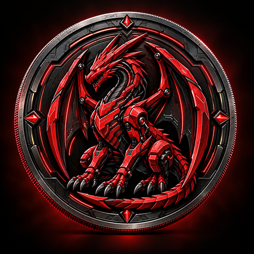

# DRAC Brand Assets

Official artwork restored from the production backup:

| File | Dimensions | Purpose |
|---|---|---|
| `dracul-coin-logo-master.png` | 1254 × 1254 | Canonical master artwork |
| `drac-coin-512.png` | 512 × 512 | README and token metadata |
| `drac-coin-256.png` | 256 × 256 | Compact web display |

The master matches the production freeze SHA-256:
`4a0712e7832c1e93896a79ef16c02c31ac8c153b3f12b588a7f74b8a8a36e7b0`.

The previous `drac-coin-128.png` was corrupt and has been replaced by the valid 512 px asset. Use the `logoURI` in `../tokenlist.json` for token integrations.

These files are the existing official artwork, not a redesigned logo.
