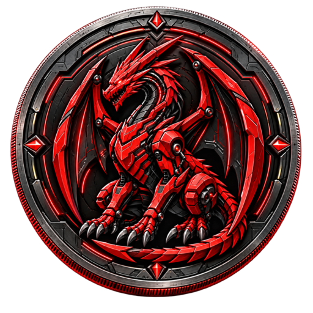

# DRAC Brand Assets

Official artwork restored from the production backup:

| File | Dimensions | Purpose |
|---|---|---|
| `dracul-coin-logo-master.png` | 1254 × 1254 | Canonical master artwork |
| `drac-coin-512.png` | 512 × 512 | Original artwork with background |
| `drac-coin-256.png` | 256 × 256 | Compact web display |

The master matches the production freeze SHA-256:
`4a0712e7832c1e93896a79ef16c02c31ac8c153b3f12b588a7f74b8a8a36e7b0`.

The previous `drac-coin-128.png` was corrupt and has been replaced by the valid 512 px asset. Use the `logoURI` in `../tokenlist.json` for token integrations.

The original master and its recorded hash are preserved.

## Transparent display logo

`drac-coin-transparent-512.png` and `drac-coin-transparent-256.png` are display derivatives created with background extraction assisted by image generation. Transparent pixels outside the coin remove the square backdrop. These derivatives are used for the README, token metadata and organization avatar; they are not the frozen production master and do not carry its hash.
